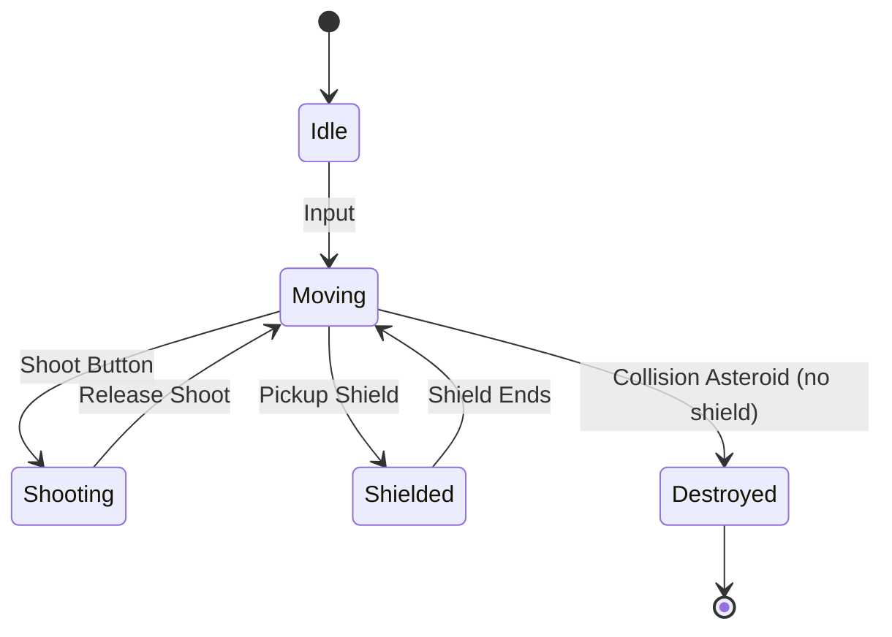
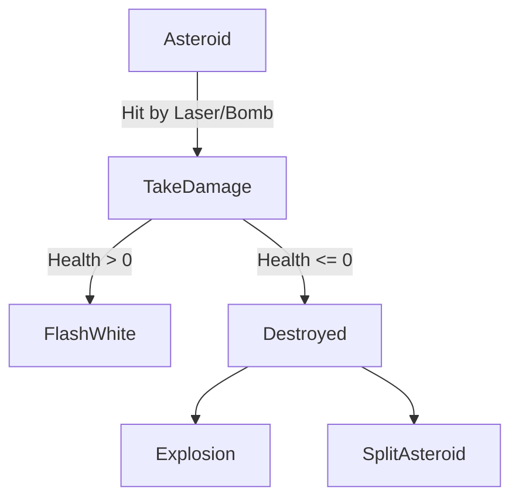
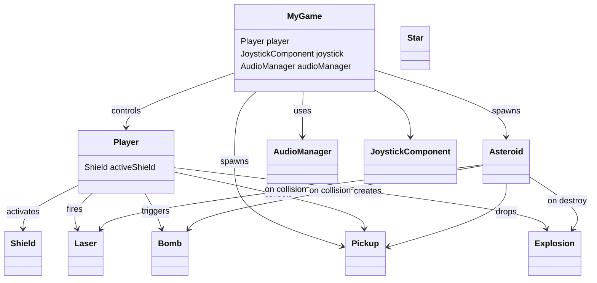

# FlameGame Space Shooter 🪐

This documentation covers the architecture and deployment instructions for a space shooter game built with [Flame](https://flame-engine.org/), a modular Flutter game engine. The game features asteroids, lasers, bombs, pickups, and a player with shields, with overlays for game state transitions and audio management.

---
##  Demo


https://github.com/user-attachments/assets/7d7ea1cc-7626-419d-abc7-74ce6ad077dc


## File & Component Overview

Below is a detailed breakdown of each core file and its responsibilities within the game architecture.

---

### `main.dart`

The entry point of the application. It initializes the game, sets up overlays, and launches the Flutter app with the `GameWidget`.

```dart
void main() {
  final MyGame game = MyGame();
  runApp(
    GameWidget(
      game: game,
      overlayBuilderMap: {
        "GameOver": (BuildContext context, MyGame game) => GameOverOverlay(game: game),
        "Title": (BuildContext context, MyGame game) => TitleOverlay(game: game),
      },
      initialActiveOverlays: const ['Title'],
    ),
  );
}
```

- **Purpose:**  
  - Bootstraps the `MyGame` instance.
  - Registers overlays: `GameOverOverlay` and `TitleOverlay`.
  - Shows the title screen by default.

---

### `my_game.dart`

The main game logic. Handles player, asteroids, pickups, score, overlays, and lifecycle events.

#### Key Responsibilities

- Initializes and manages the core gameplay loop.
- Manages spawning of asteroids and pickups.
- Handles overlays (game over, title).
- Audio, joystick, and shoot button setup.

#### Important Properties

| Property              | Purpose                                  |
|-----------------------|------------------------------------------|
| `player`              | The main controllable character.         |
| `_asteroid`           | Asteroid spawner.                        |
| `joystick`            | On-screen joystick.                      |
| `_score`              | Player's score.                          |
| `audioManager`        | Handles audio effects and music.         |

#### Main Methods

- `onLoad()`: Sets up the initial game state and overlays.
- `startGame()`: Starts the game session.
- `restartGame()`: Resets the game after game over.
- `quitGame()`: Returns to the title screen.
- `incrmenetScore(int)`: Updates the score with a visual effect.

#### Game Flow

```mermaid
flowchart TD
    A[Game Start] -->|Show Title| B[TitleOverlay]
    B -->|Start| C[Initialize Game (startGame)]
    C --> D[Gameplay Loop]
    D -->|Player Dies| E[GameOverOverlay]
    E -->|Play Again| C
    E -->|Quit| B
```

---

### `title_overlay.dart`

A Flutter `StatefulWidget` providing the title screen. Lets players pick a color, toggle music/sfx, and start the game.

#### Features

- Animated fade-in/out for smooth transitions.
- Color selector for the player ship.
- Music and sound toggle buttons.
- Start button to begin gameplay.

---

### `star.dart`

A background starfield effect. Each `Star` is a moving white dot with randomized size and speed.

#### Behavior

- Random size and position at spawn.
- Moves down the screen, respawning at the top when it exits the bottom.

---

### `explosion.dart`

Handles visual explosion effects when asteroids or the player are destroyed.

#### Features

- Supports multiple explosion types: `dust`, `smoke`, `fire`.
- Plays explosion sound.
- Particle effects and a flash effect.
- Self-removes after a duration.

---

### `game_over_overlay.dart`

A Flutter overlay for the game over screen.

#### Features

- Fades in with opacity animation.
- Displays "GAME OVER" and current score.
- "Play Again" and "Quit Game" buttons.
- Plays button sound on action.

---

### `assets.dart`

A static asset reference utility.

#### Exposes

- String constants for every image and audio file used in the game.
- `selectPlayer(color)` helper to get filenames for player sprite animations per color.

#### Example

```dart
Assets.assetsAudioClick; // returns "click.ogg"
Assets.assetsImagesPlayerBlueOff; // returns "player_blue_off.png"
Assets.selectPlayer("blue"); // returns ("player_blue_on0.png", "player_blue_on1.png", "player_blue_off.png")
```

---

### `shield.dart`

A temporary protective shield for the player.

#### Features

- Loads the shield sprite and attaches to the player.
- Pulses with a scaling effect.
- Gradually fades out and removes itself after a delay.
- Destroys asteroids on collision.

---

### `shoot_button.dart`

A touch button to fire the player's laser.

#### Features

- Loads a sprite and anchors to the bottom right.
- On tap, triggers the player's shooting action.
- Plays a firing sound.

---

### `audio_manager.dart`

Manages all game audio: sound effects and background music.

#### Features

- Loads audio assets via `Soundpool` and `FlameAudio`.
- Plays sounds and music on demand.
- Enables/disables music and sound via toggles.
- Ensures background music loops and sound effects don't overlap.

#### Example

```dart
audioManager.playSound("laser");
audioManager.toggleMusic();
audioManager.toggleSounds();
```

---

### `player.dart`

The main player component. Handles input, movement, shooting, collision, power-ups, and destruction.

#### Key Features

- Supports joystick and keyboard movement.
- Animated sprite (per color).
- Shoots lasers; supports triple-shot powerup.
- Handles shield, bomb, and laser pickups.
- Handles destruction and explosion effects.
- Ensures player stays within screen bounds.
- Manages collision with asteroids and pickups.

#### Collision Handling

- **Asteroid:** Destroys player (unless shielded).
- **Pickup:** Triggers the respective powerup (bomb, shield, or laser).

#### State Diagram



---

### `pickup.dart`

A collectible that grants the player a bomb, shield, or laser powerup.

#### Features

- Animated pulsing effect.
- Moves downward; despawns when off-screen.
- On collision, applies the pickup effect to the player.

#### Types

| PickupType | Effect                 |
|------------|-----------------------|
| bomb       | Spawns a bomb         |
| laser      | Enables triple-shot   |
| shield     | Activates shield      |

---

### `asteroid.dart`

The main enemy obstacle.

#### Features

- Random size, sprite, velocity, and spin.
- Bounces off screen edges, wraps horizontally.
- Takes multiple hits to destroy (health based on size).
- Splits into smaller asteroids on destruction.
- Plays sound and explosion effect on hit.

#### Behavior Flow



---

### `bomb.dart`

A large area-effect attack.

#### Features

- Spawns from the player on bomb pickup.
- Grows in size via animation, then fades and removes itself.
- Destroys asteroids on collision during its active phase.

---

### `laser.dart`

The player's main weapon.

#### Features

- Moves upward (or angled with powerup).
- Removes itself when off-screen or upon hitting an asteroid.
- Destroys asteroids on collision.

---

## Component Relationships



---

## Configuration

- **Audio & Music:**  
  - All paths and toggles are hardcoded via `assets.dart` and `audio_manager.dart`.
  - No additional configuration needed, but can be modified in code.
- **Overlays:**  
  - Overlay names ("GameOver", "Title") are referenced throughout overlays and game logic.
- **Assets:**  
  - Ensure all referenced assets exist in `assets/images/` and `assets/audio/`.
- **Screen Mode:**  
  - The game runs in fullscreen and portrait mode by default.

---

## Troubleshooting

- **Missing Assets:**  
  If the game fails to load sprites or audio, check the `pubspec.yaml` asset list and asset files.
- **No Sound:**  
  Ensure device volume is up and permissions are granted if required on mobile.
- **Performance:**  
  For best performance, run on a device/emulator with hardware acceleration.

---

## Summary

This project demonstrates a modular approach to building a 2D space shooter in Flutter using Flame. It features overlays, animated effects, powerups, and rich component interactions. All logic and assets are organized by game responsibility, making it easy to extend or modify.

**Happy gaming! 🚀**
